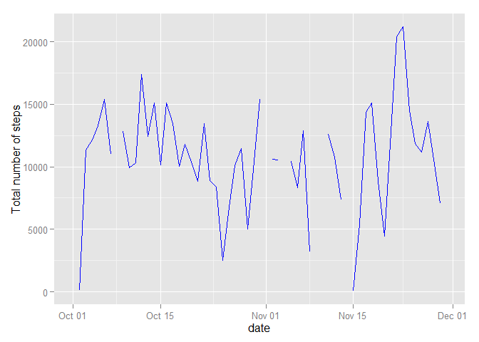
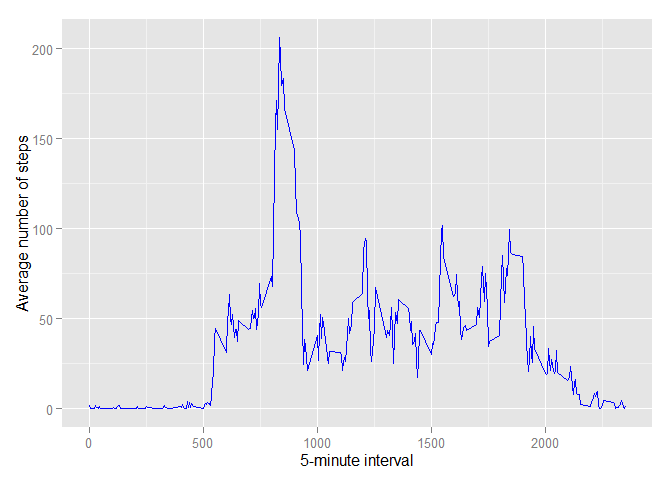
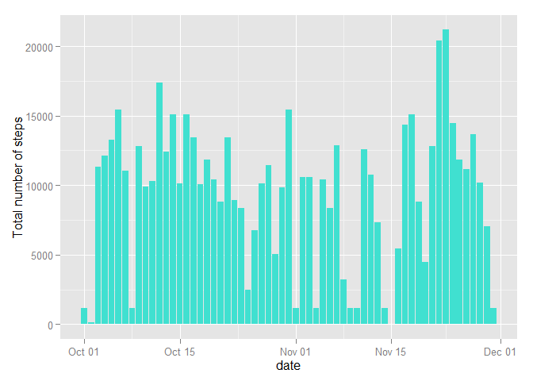
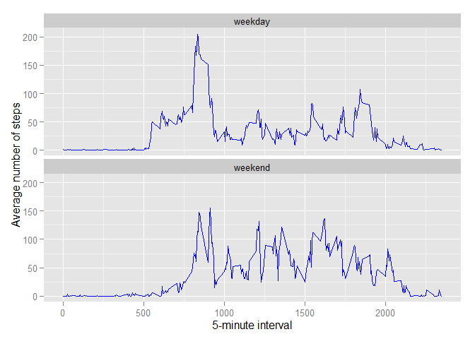

# Reproducible Research: Peer Assessment 1
EMFS  
Saturday, April 18, 2015  


### Loading and preprocessing the data

Loading data directly from local zip file of the Github project fork (and caching the resulting data)

```r
data <- read.csv(unz("activity.zip", filename = "activity.csv"))
# converting factor strings to dates
data$date <- as.Date(x = data$date, format = "%Y-%m-%d")
```
Summary of the activity data:

```r
summary(data)
```

```
##      steps             date               interval     
##  Min.   :  0.00   Min.   :2012-10-01   Min.   :   0.0  
##  1st Qu.:  0.00   1st Qu.:2012-10-16   1st Qu.: 588.8  
##  Median :  0.00   Median :2012-10-31   Median :1177.5  
##  Mean   : 37.38   Mean   :2012-10-31   Mean   :1177.5  
##  3rd Qu.: 12.00   3rd Qu.:2012-11-15   3rd Qu.:1766.2  
##  Max.   :806.00   Max.   :2012-11-30   Max.   :2355.0  
##  NA's   :2304
```

```r
str(data)
```

```
## 'data.frame':	17568 obs. of  3 variables:
##  $ steps   : int  NA NA NA NA NA NA NA NA NA NA ...
##  $ date    : Date, format: "2012-10-01" "2012-10-01" ...
##  $ interval: int  0 5 10 15 20 25 30 35 40 45 ...
```

### What is the mean total number of steps taken per day?

Group steps by day:

```r
require(dplyr)
totalStepsPerDay <- data %>% group_by(date) %>% summarise(totalSteps=sum(steps))
```

Total number of steps taken each day in a bar plot:

```r
require(ggplot2)
ggplot(data = totalStepsPerDay, aes(date, totalSteps)) + geom_bar(stat = "identity", fill="turquoise") + ylab("Total number of steps")
```

```
## Warning: Removed 8 rows containing missing values (position_stack).
```

 

Total number of steps taken each day in a line plot:

```r
ggplot(data = totalStepsPerDay, aes(date, totalSteps)) + geom_line(color="blue") + ylab("Total number of steps")
```

```
## Warning: Removed 2 rows containing missing values (geom_path).
```

 

Mean and median number of steps taken each day

```r
# While discarding NA values:
totalStepsPerDay %>% summarise(mean_steps=mean(totalSteps, na.rm=TRUE), median_steps=median(totalSteps, na.rm=TRUE))
```

```
## Source: local data frame [1 x 2]
## 
##   mean_steps median_steps
## 1   10766.19        10765
```

### What is the average daily activity pattern?

Time series plot of the 5-minute interval (x-axis) and the average number of steps taken, averaged across all days (y-axis).

```r
# Still discarding NA values
averageStepsPerInterval <- data %>% group_by(interval) %>% summarise(averageSteps=mean(steps, na.rm = TRUE))
ggplot(data = averageStepsPerInterval, aes(interval, averageSteps)) + geom_line(color="blue") + xlab("5-minute interval") + ylab("Average number of steps")
```

 

Which 5-minute interval, on average across all the days in the dataset, contains the maximum number of steps?

```r
maxInterval <- averageStepsPerInterval %>% filter(averageSteps == max(averageSteps))
maxInterval
```

```
## Source: local data frame [1 x 2]
## 
##   interval averageSteps
## 1      835     206.1698
```
This maximum 5-minute interval corresponds to 13.92 hours.


### Imputing missing values

Calculate and report the total number of missing values in the dataset (i.e. the total number of rows with NAs)

```r
data %>% filter(is.na(steps)) %>% summarise(n())
```

```
##    n()
## 1 2304
```

In order to fill these missing values, one can imput the median number of steps for that particular 5-minute intervall across all the days of activity. This should introduce little distortion or bias in the data.

```r
medianStepsPerInterval <- data %>% group_by(interval) %>% summarise(medianSteps=median(steps, na.rm = TRUE))
dataFilled <- left_join(data, medianStepsPerInterval, by='interval')
dataFilled <- dataFilled %>% mutate(steps = ifelse(is.na(steps), medianSteps, steps)) %>% select(-medianSteps)
```

Bar plot of the total number of steps taken each day after missing values were imputed

```r
totalStepsPerDayFilled <- dataFilled %>% group_by(date) %>% summarise(totalStepsFilled=sum(steps))
ggplot(data = totalStepsPerDayFilled, aes(date, totalStepsFilled)) + geom_bar(stat = "identity", fill="turquoise") + ylab("Total number of steps")
```

 

Mean and median number of steps taken each day after imputing missing data:

```r
# After imputing all NA values:
totalStepsPerDayFilled %>% summarise(mean_steps=mean(totalStepsFilled, na.rm=TRUE), median_steps=median(totalStepsFilled, na.rm=TRUE))
```

```
## Source: local data frame [1 x 2]
## 
##   mean_steps median_steps
## 1   9503.869        10395
```

These values do not differ significantly from the estimates made with the missing values:  
- the mean is reduced by 11.72%  
- the median is reduced by 3.44%


```r
a <- summarise(data, sum(steps, na.rm = TRUE))
b <- summarise(dataFilled, sum(steps))
```
The impact of imputing missing data on the estimates of the total daily number of steps only leads to a change from 570608 to 579736 or an increase of 1.6%.

### Are there differences in activity patterns between weekdays and weekends?

```r
# the weekdays() function returns a string with the day of the week, that can be used to determine if it's a
# weekday or weekend day, that is stored in a factor variable
dataFilled <- mutate(dataFilled, dayweek = ifelse(test = (weekdays(date) %in% c("Saturday","Sunday")), yes = 1, no = 0)) %>% mutate(dayweek = factor(x = dayweek, labels = c("weekday", "weekend")))
```

The panel plot contains a time series plot of the 5-minute interval (x-axis) and the average number of steps taken, averaged across all weekday days or weekend days (y-axis).

```r
averageStepsPerIntervalDayWeek <- dataFilled %>% group_by(dayweek, interval) %>% summarise(averageSteps=mean(steps))
ggplot(data = averageStepsPerIntervalDayWeek, aes(interval, averageSteps)) + geom_line(color='blue') + xlab("5-minute interval") + ylab("Average number of steps") + facet_wrap(~dayweek, nrow=2)
```

 
